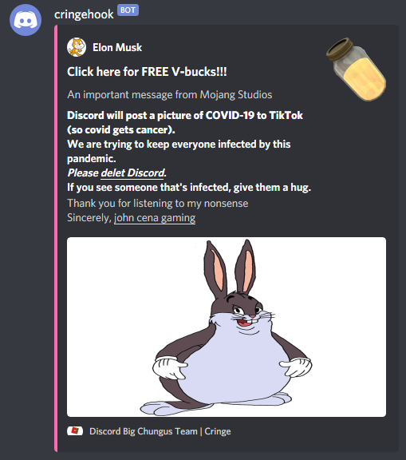

# cringehook
A Discord webhook that posts a funny!!1!



*laugh*

---
## Installation
### Dependencies
* Node.js v12.0.0 or later
* Discord.js v12.0.0 or later
### Process
Navigate to the directory of your project.

Run `npm install --save cringehook` to install cringehook. Details on using it can be found [below](#usage).

## Usage
If you want to skip writing code and just use cringehook, see [test script](#test-script).

After having installed cringehook into your project with npm, add `const cringehook = require("cringehook");` to the top of the file where you wish to use cringehook.
This will expose the `cringehook.postCringe()` function to your file.

Usage of the function is fairly simple. Run `cringehook.postCringe(id, token);` where you replace "id" with your Webhook ID and "token" with your Webhook Token (these must be strings).

Your Webhook ID is the set of random numbers in the URL: https://discord.com/api/webhooks/__*940402354661876488*__/Xi2auN2s_TRiSJqAUvJ693RMsrD3iANsIgHG8XB8OmvQQxB0mnxKeaERfWhOgMiFvTmy7

Your Webhook Token is the set of random characters at the end of the URL: https://discord.com/api/webhooks/940402354661876488/__*Xi2auN2s_TRiSJqAUvJ693RMsrD3iANsIgHG8XB8OmvQQxB0mnxKeaERfWhOgMiFvTmy7*__

Example usage:

```js
const cringehook = require("cringehook");
cringehook.postCringe("940402354661876488", "Xi2auN2s_TRiSJqAUvJ693RMsrD3iANsIgHG8XB8OmvQQxB0mnxKeaERfWhOgMiFvTmy7")
    .then(a => {process.exit();});
```

The function will return a promise that is fulfilled upon success and rejected on an error. It will also throw a DiscordAPIError if any occurs.

Advanced example usage (try/catch and async/await):
```js
const cringehook = require("cringehook");
async function ccring() {
    try {
        await cringehook.postCringe("940402354661876488", "Xi2auN2s_TRiSJqAUvJ693RMsrD3iANsIgHG8XB8OmvQQxB0mnxKeaERfWhOgMiFvTmy7");
    } catch (err) {
        console.error(`Error posting funny: ${err}`);
        process.exit(1);
    }
    console.log("Successfully posted a funny");
    process.exit();
}
ccring();
```

This uses the try/catch syntax to catch any thrown error. [See a list of common errors below](#common-errors).

### Test script
If you wish, you can also use the built-in test script. Navigate to the module directory (`cd node_modules/cringehook`) and run `node test [id] [token]` where id and token are the Webhook ID and Token as explained above.

## Common errors:
* `DiscordAPIError: 404: Not Found`: You didn't supply a token.
* `DiscordAPIError: Invalid Form Body webhook_id: Value "" is not snowflake.`: The ID contained non-numeric characters (invalid).
* `DiscordAPIError: Invalid Webhook Token`: The supplied token is invalid or incorrect.
* `DiscordAPIError: Unknown Webhook`: The supplied webhook ID doesn't exist, or the wrong data type was given.
* `DiscordAPIError: 405: Method Not Allowed`: You didn't supply a token or some data was invalid.

## text
idk

## License
cringehook is licensed under the [MIT License](./LICENSE).
